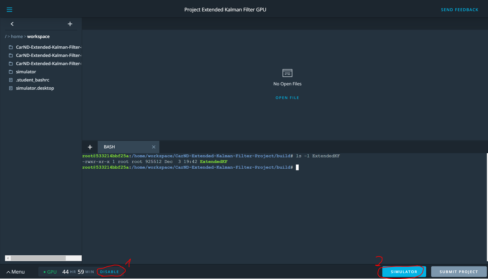
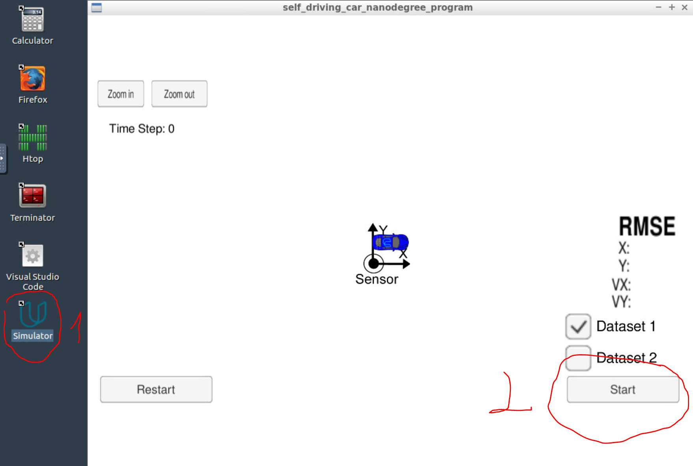
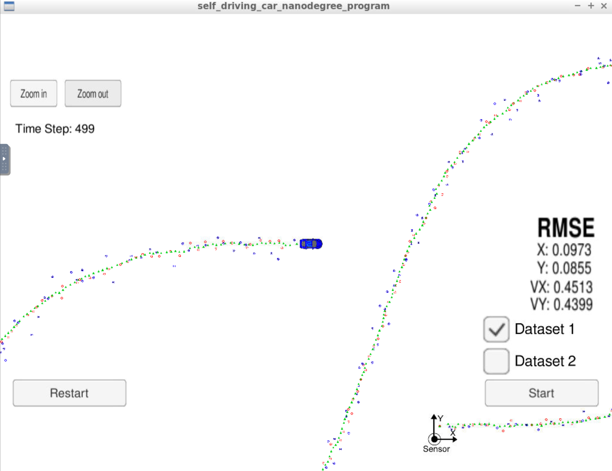

# CarND-Extended-Kalman-Filter Project 5
Udacity Self-Driving Car Nanodegree - Extended Kalman Filter Implementation

# Overview

This project consists of implementing an [Extended Kalman Filter](https://en.wikipedia.org/wiki/Extended_Kalman_filter) in C++. 
A simulator provided by Udacity feeds noisy RADAR and LIDAR measurements (taken out of a Udacity provided data file) of the position and velocity of an object. 
The Extended Kalman Filter[EKF] will fusion the measurements to predict the position of the object. 

# Prerequisites

As the Udacity provided workspace hase been used, not extra prerequsites are required.
If the project shall be rebuild locally, consult the Udacity documentation about prerequisites and how to set-up your local
enviromment for MacOS, Linux/Unix or Windows.

# Compiling and executing the project

In Udacity Workspace excecute the following statements to build and run the [EKF]
- `cd CarND-Extended-Kalman-Filter-Project` 
- `mkdir build`
- `cd build`
- `cmake ..` : To build the makefile(s)
- `make`: To build the executable
- Finally you will get the executable `ExtendedKF` 
You might get some warnings, which you can ignore in this case, as long as the executable has been build.
You can check with `ls -l ExtendedKF` if the executable has the current date and time.


## Running the Filter

If you are working with the Udaycity Workspace:
- ensure that GPU mode is enabled (1)
- start the Simumaltor Environment by clicking on [Simulator] button (2)


- within the Simulator Window Click on [Simulator] (1)
- when the Simulator Windows opens and you are in the App Click on [Start] (2)


From the build directory, execute `./ExtendedKF`. The output should be:

```
Listening to port 4567
Connected!!!
```

The simulator starts running, feeds the [EKF] with the sensor data and draws the result on the screen.

The following images shows the final image together with the results 



